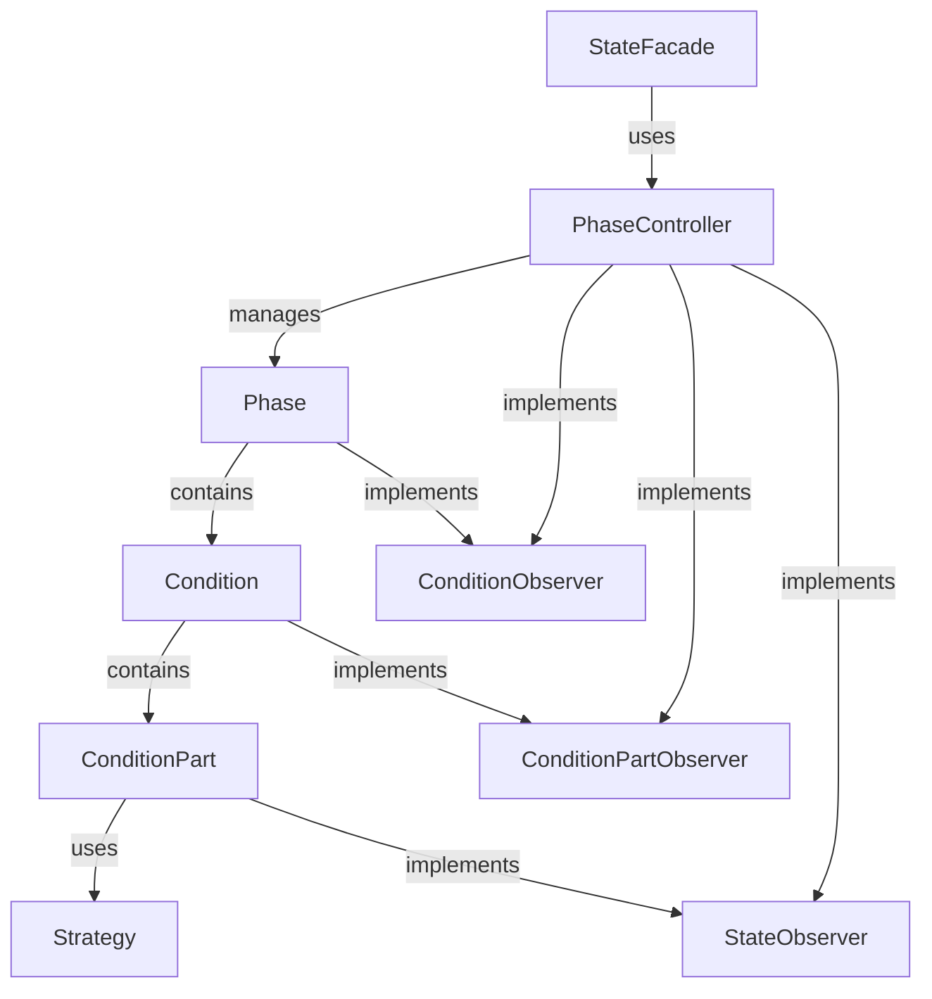

# システムパターン

## アーキテクチャ概要

このプロジェクトは、クリーンアーキテクチャの原則に従い、以下の層に分かれています：

1. **ドメイン層** (`internal/domain/`)
   - エンティティ（Phase, Condition, ConditionPart）
   - 値オブジェクト（GameState, Types）
   - ドメインサービス（Observer, Strategy）

2. **ユースケース層** (`internal/usecase/`)
   - PhaseController: フェーズの管理と状態遷移の制御
   - StateFacade: システム全体のインターフェース
   - Strategy実装: 条件評価のロジック

3. **インターフェース層** (`internal/ui/`)
   - WebSocketサーバー
   - HTTPハンドラ
   - 静的ファイル（HTML, CSS, JavaScript）

4. **インフラストラクチャ層** (`internal/lib/`)
   - ロギング機能
   - ユーティリティ

## 主要設計パターン

### Observer/Subjectパターン

状態変更の通知に使用されています。以下のインターフェースが定義されています：

- `StateObserver`: 状態変更の通知を受け取る
- `ConditionObserver`: 条件の変更を監視する
- `ConditionPartObserver`: 条件パーツの変更を監視する
- `StrategyObserver`: 戦略の更新を監視する

対応するSubjectインターフェースも実装されています。

### 有限状態機械（FSM）

`looplab/fsm`ライブラリを使用して、以下のコンポーネントの状態遷移を管理しています：

- `Phase`: ready → active → next → finish
- `Condition`: ready → unsatisfied → satisfied
- `ConditionPart`: ready → unsatisfied → processing → satisfied

### 戦略パターン

条件パーツの評価ロジックを抽象化するために使用されています：

- `PartStrategy`: 戦略のインターフェース
- `CounterStrategy`: カウンターベースの条件評価
- `TimeStrategy`: 時間ベースの条件評価

### ファサードパターン

`StateFacade`は、システムの複雑さを隠蔽し、シンプルなインターフェースを提供します。

## コンポーネント関係

## 重要な技術的決定

1. **FSMライブラリの採用**
   - `looplab/fsm`を使用して状態遷移を管理
   - 状態遷移のロジックを集中化
   - コールバック機能を活用した通知システム

2. **Observer/Subjectパターンの採用**
   - コンポーネント間の疎結合を実現
   - 状態変更の効率的な通知
   - 拡張性の向上

3. **条件評価の抽象化**
   - 戦略パターンによる評価ロジックの分離
   - 新しい条件タイプの追加が容易
   - テスト容易性の向上

4. **WebSocketによるリアルタイム通信**
   - 状態変更のリアルタイム通知
   - クライアント側の即時更新
   - 双方向通信の実現

5. **構造化ログの採用**
   - `go.uber.org/zap`を使用した効率的なロギング
   - デバッグ情報の充実
   - パフォーマンスへの配慮