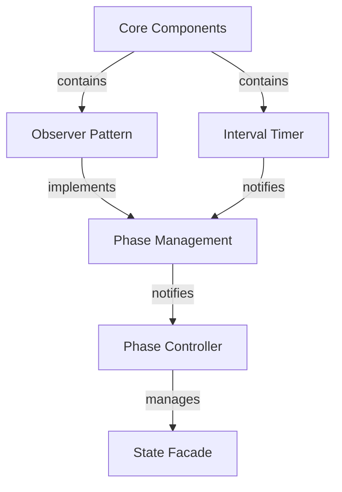
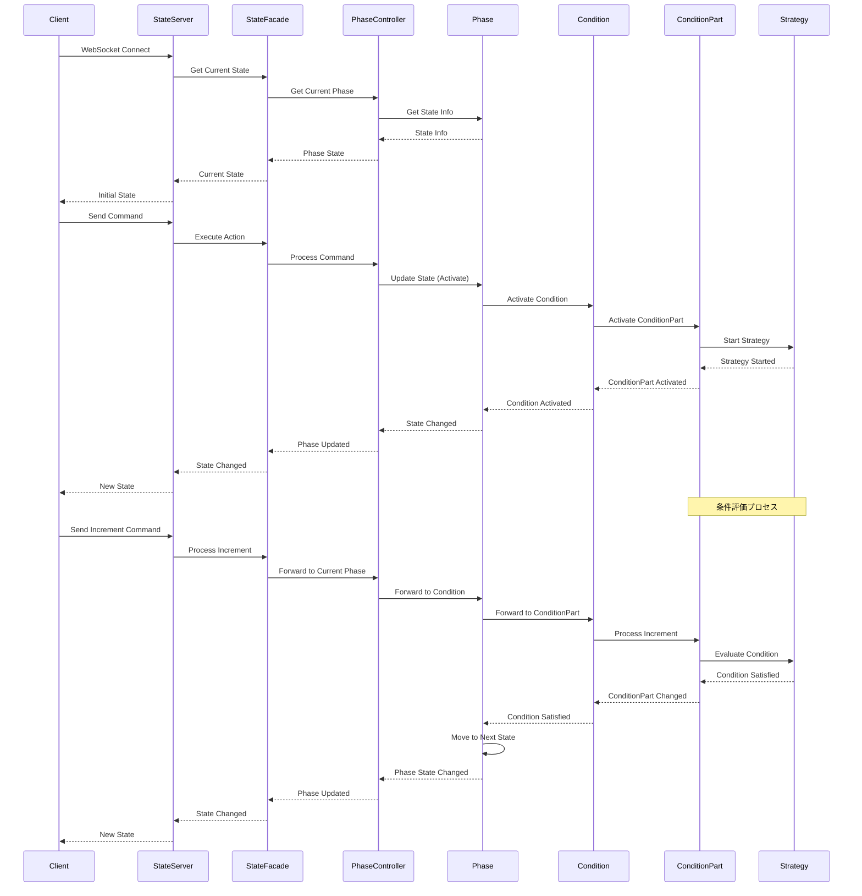
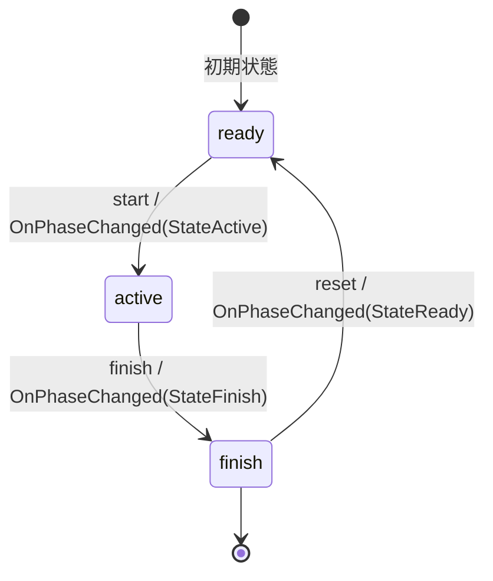
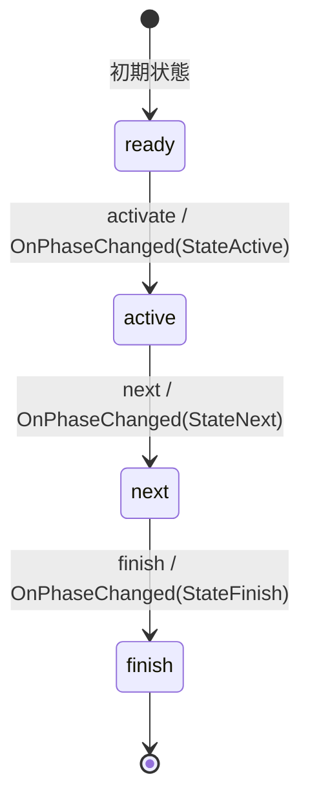
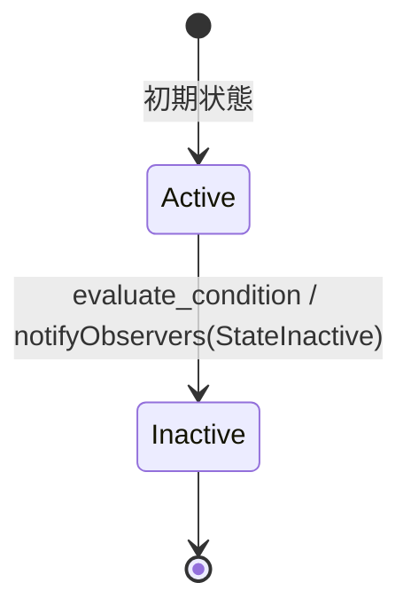
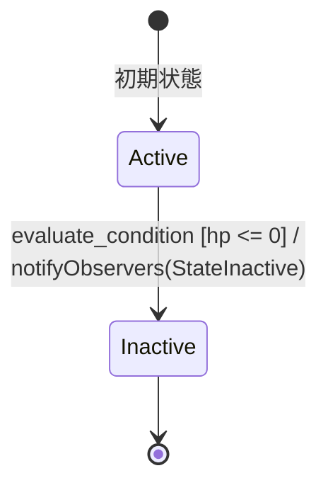

# State Machine Visualization Sample

このプロジェクトは、looplab/fsmを使用した状態遷移の可視化サンプルアプリケーションです。Observer/Subjectパターンを採用し、効率的な状態管理と通知を実現しています。

## 機能

- 現在の状態をリアルタイムに表示
- 状態間の遷移を視覚的に表現
- シンプルなUIによる状態遷移の制御
- WebSocketを使用したリアルタイム更新
- 最適化された状態遷移制御
- 構造化ログによるデバッグ支援

## プロジェクト構造

```
state_sample/
├── main.go                # エントリーポイント
├── go.mod                # モジュール定義
├── docs/                 # ドキュメント
│   └── state_machines_prd/ # 状態遷移の仕様
├── internal/
│   ├── domain/          # ドメイン層
│   │   ├── core/       # コア機能
│   │   │   ├── observer.go    # Observer定義
│   │   │   ├── subject.go     # Subject定義
│   │   │   └── interval_timer.go # タイマー実装
│   │   └── entity/    # エンティティ
│   │       ├── game_state.go  # 状態定義
│   │       └── phase.go       # フェーズ実装
│   ├── usecase/       # ユースケース層
│   │   ├── phase_controller.go # フェーズ制御
│   │   └── state_facade.go    # システムインターフェース
│   ├── lib/           # 共通ライブラリ
│   │   └── logger.go  # ロギング機能
│   └── ui/            # UI層
│       ├── server.go   # WebSocketサーバー
│       ├── handlers.go # リクエストハンドラ
│       └── static/     # 静的ファイル
│           ├── index.html  # メインページ
│           ├── style.css   # スタイル
│           └── script.js   # クライアントサイドロジック
```

## アーキテクチャ

### コアコンポーネント



### 状態遷移制御



## クラス図

```mermaid
classDiagram
    class Phase {
        +ID PhaseID
        +Order int
        -isActive bool
        +IsClear bool
        +Name string
        +Description string
        +Rule GameRule
        +ConditionType ConditionType
        +ConditionIDs []ConditionID
        +SatisfiedConditions map[ConditionID]bool
        +Conditions map[ConditionID]*Condition
        +StartTime *time.Time
        +FinishTime *time.Time
        -fsm *fsm.FSM
        -observers []StateObserver
        -mu sync.RWMutex
        -log *zap.Logger
        +NewPhase(name, order, conditions, conditionType, rule)
        +OnConditionChanged(condition)
        -checkConditionsSatisfied() bool
        +CurrentState() string
        +GetStateInfo() *GameStateInfo
        +GetConditions() map[ConditionID]*Condition
        +Activate(ctx) error
        +Next(ctx) error
        +Finish(ctx) error
        +Reset(ctx) error
        +AddObserver(observer)
        +RemoveObserver(observer)
        +NotifyStateChanged(state)
    }

    class Phases {
        +Current() *Phase
        +ResetAll(ctx) error
        +ProcessAndActivateByNextOrder(ctx) (*Phase, error)
    }

    class Condition {
        +ID ConditionID
        +Label string
        +Kind ConditionKind
        +Parts map[ConditionPartID]*ConditionPart
        +Name string
        +Description string
        +IsClear bool
        +StartTime *time.Time
        +FinishTime *time.Time
        -fsm *fsm.FSM
        -stateObservers []StateObserver
        -condObservers []ConditionObserver
        -mu sync.RWMutex
        -log *zap.Logger
        -satisfiedParts map[ConditionPartID]bool
        +NewCondition(id, label, kind)
        +GetParts() []*ConditionPart
        +OnConditionPartChanged(part)
        -checkAllPartsSatisfied() bool
        +Validate() error
        +CurrentState() string
        +Activate(ctx) error
        +Complete(ctx) error
        +Revert(ctx) error
        +Reset(ctx) error
        +AddPart(part)
        +InitializePartStrategies(factory) error
        +AddObserver(observer)
        +RemoveObserver(observer)
        +NotifyStateChanged()
        +AddConditionObserver(observer)
        +RemoveConditionObserver(observer)
        +NotifyConditionChanged()
    }

    class ConditionPart {
        +ID ConditionPartID
        +Label string
        +ComparisonOperator ComparisonOperator
        +IsClear bool
        +TargetEntityType string
        +TargetEntityID int64
        +ReferenceValueInt int64
        +ReferenceValueFloat float64
        +ReferenceValueString string
        +MinValue int64
        +MaxValue int64
        +Priority int32
        +StartTime *time.Time
        +FinishTime *time.Time
        -fsm *fsm.FSM
        -mu sync.RWMutex
        -log *zap.Logger
        -strategy PartStrategy
        -partObservers []ConditionPartObserver
        +NewConditionPart(id, label)
        +GetReferenceValueInt() int64
        +GetComparisonOperator() ComparisonOperator
        +GetMaxValue() int64
        +GetMinValue() int64
        +IsSatisfied() bool
        +GetCurrentValue() interface
        +OnUpdated(event)
        +Validate() error
        +CurrentState() string
        +Activate(ctx) error
        +Process(ctx, increment) error
        +Complete(ctx) error
        +Timeout(ctx) error
        +Revert(ctx) error
        +Reset(ctx) error
        +SetStrategy(strategy) error
        +AddConditionPartObserver(observer)
        +RemoveConditionPartObserver(observer)
        +NotifyPartChanged()
    }

    class GameState {
        +CurrentState string
        +StateInfo *GameStateInfo
        +Phases Phases
        +CurrentPhase *Phase
        +NewGameState(phases)
        +SetCurrentPhase(phase)
        +GetCurrentPhase() *Phase
        +GetPhases() Phases
        +GetStateInfo() *GameStateInfo
        +UpdateState(state)
    }

    class PhaseController {
        -phases Phases
        -currentPhase *Phase
        -observers struct
        -mu sync.RWMutex
        -log *zap.Logger
        +NewPhaseController(phases)
        +OnPhaseChanged(stateName)
        +OnConditionChanged(condition)
        +OnConditionPartChanged(part)
        +GetCurrentPhase() *Phase
        +SetCurrentPhase(phase)
        +GetPhases() []*Phase
        +Start(ctx) error
        +Reset(ctx) error
        +AddStateObserver(observer)
        +RemoveStateObserver(observer)
        +NotifyStateChanged(state)
        +AddConditionObserver(observer)
        +RemoveConditionObserver(observer)
        +NotifyConditionChanged()
        +AddConditionPartObserver(observer)
        +RemoveConditionPartObserver(observer)
        +NotifyConditionPartChanged(part)
    }

    class StateFacade {
        <<interface>>
        +Start(ctx) error
        +Reset(ctx) error
        +GetCurrentPhase() *Phase
        +GetController() *PhaseController
        +GetConditionPart(conditionID, partID) (*ConditionPart, error)
    }

    class stateFacadeImpl {
        -controller *PhaseController
        +NewStateFacade()
        +Start(ctx) error
        +Reset(ctx) error
        +GetCurrentPhase() *Phase
        +GetController() *PhaseController
        +GetConditionPart(conditionID, partID) (*ConditionPart, error)
    }

    class PartStrategy {
        <<interface>>
        +Initialize(part) error
        +GetCurrentValue() interface
        +Start(ctx, part) error
        +Evaluate(ctx, part, params) error
        +Cleanup() error
        +AddObserver(observer)
        +RemoveObserver(observer)
        +NotifyUpdate(event)
    }

    class CounterStrategy {
        -currentValue int64
        -observers []StrategyObserver
        -mu sync.RWMutex
        +NewCounterStrategy()
        +Initialize(part) error
        +GetCurrentValue() interface
        +Start(ctx, part) error
        +Evaluate(ctx, part, params) error
        +Cleanup() error
        +AddObserver(observer)
        +RemoveObserver(observer)
        +NotifyUpdate(event)
    }

    class TimeStrategy {
        -observers []StrategyObserver
        -interval time.Duration
        -isRunning bool
        -ticker *time.Ticker
        -stopChan chan struct
        -mu sync.RWMutex
        -nextTrigger time.Time
        -log *zap.Logger
        +NewTimeStrategy()
        +Initialize(part) error
        +GetCurrentValue() interface
        +Start(ctx, part) error
        +Evaluate(ctx, part, params) error
        +Cleanup() error
        -updateNextTrigger()
        -run()
        +AddObserver(observer)
        +RemoveObserver(observer)
        +NotifyUpdate(event)
    }

    class StrategyFactory {
        +NewStrategyFactory()
        +CreateStrategy(kind) (PartStrategy, error)
    }

    class StateObserver {
        <<interface>>
        +OnPhaseChanged(state)
    }

    class StrategyObserver {
        <<interface>>
        +OnUpdated(event)
    }

    class ConditionPartObserver {
        <<interface>>
        +OnConditionPartChanged(part)
    }

    class ConditionObserver {
        <<interface>>
        +OnConditionChanged(condition)
    }

    class StrategySubject {
        <<interface>>
        +AddObserver(observer)
        +RemoveObserver(observer)
        +NotifyUpdate(event)
    }

    class ConditionSubject {
        <<interface>>
        +AddConditionObserver(observer)
        +RemoveConditionObserver(observer)
        +NotifyConditionChanged()
    }

    class ConditionPartSubject {
        <<interface>>
        +AddConditionPartObserver(observer)
        +RemoveConditionPartObserver(observer)
        +NotifyPartChanged(part)
    }

    Phase "1" *-- "*" Condition
    Condition "1" *-- "*" ConditionPart
    GameState "1" *-- "1" Phases
    Phases "1" *-- "*" Phase
    PhaseController "1" *-- "1" Phases
    PhaseController ..|> StateObserver
    PhaseController ..|> ConditionObserver
    PhaseController ..|> ConditionPartObserver
    stateFacadeImpl "1" *-- "1" PhaseController
    stateFacadeImpl ..|> StateFacade
    ConditionPart "1" *-- "1" PartStrategy
    CounterStrategy ..|> PartStrategy
    TimeStrategy ..|> PartStrategy
    StrategyFactory ..> PartStrategy : creates
    Phase ..|> ConditionObserver
    Condition ..|> ConditionSubject
    Condition ..|> ConditionPartObserver
    ConditionPart ..|> StrategyObserver
    ConditionPart ..|> ConditionPartSubject
    CounterStrategy ..|> StrategySubject
    TimeStrategy ..|> StrategySubject
```



## 状態遷移図

### ゲーム状態遷移図



### フェーズ状態遷移図



### サブフェーズ状態遷移図


### 条件状態遷移図



### 条件パート状態遷移図



## 実装詳細

### Observer Pattern

- StateObserverインターフェース
  - 状態変更通知の受信
  - エラー通知の処理

- Subjectインターフェース
  - オブザーバーの管理
  - 状態変更の通知
  - スレッドセーフな実装

### フェーズ管理

- IntervalTimer
  - 時間間隔の管理
  - イベント通知
  - スレッドセーフな操作

- Phase
  - FSMとの統合
  - タイマーイベントの処理
  - 状態遷移の制御

### 状態遷移の最適化

- 不要な状態遷移の防止
- イベント通知の効率化
- リソース使用の最適化
- デバウンス処理の実装

### ロギング機能

- 構造化ログの採用
- 環境別設定（開発/本番）
- エラートレースの改善
- デバッグ情報の最適化

## 依存関係

- github.com/looplab/fsm
- github.com/gorilla/websocket
- github.com/gorilla/mux
- go.uber.org/zap

## 使用方法

1. サーバーの起動
```bash
go run main.go
```

2. ブラウザでアクセス
```
http://localhost:8080
```

## WebSocket API

### メッセージフォーマット

```json
{
  "type": "command",
  "action": "start|reset",
  "payload": {}
}
```

### イベントタイプ

1. コマンド
- start: フェーズの開始
- reset: 状態のリセット

2. 通知
- state_change: 状態変更の通知
- error: エラーの通知

## エラーハンドリング

### サーバーサイド

- 不正な状態遷移の防止
- WebSocket接続エラーの処理
- リソース管理の最適化
- エラー状態からの復帰

### クライアントサイド

- 接続エラーの処理
- 再接続ロジック
- エラー表示の実装

## パフォーマンス最適化

### 状態遷移

- イベント通知の効率化
- 不要な遷移の防止
- リソース使用の最適化

### メモリ管理

- オブザーバーの適切な解放
- WebSocket接続の管理
- リソースのクリーンアップ

## 今後の展開

1. テスト強化
- 単体テストの拡充
- 統合テストの追加
- パフォーマンステスト

2. 機能拡張
- 認証機能の追加
- セッション管理
- UI機能の強化

3. パフォーマンス改善
- さらなる最適化
- スケーラビリティの向上
- モニタリングの強化