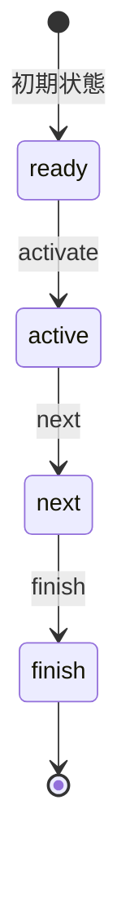

# State Machine Visualization Sample

このプロジェクトは、looplab/fsmを使用した状態遷移の可視化サンプルアプリケーションです。

## 機能

- 現在の状態をリアルタイムに表示
- 状態間の遷移を視覚的に表現
- シンプルなUIによる状態遷移の制御
- WebSocketを使用したリアルタイム更新
- エラーハンドリングの実装

## プロジェクト構造

```
state_sample/
├── main.go           # エントリーポイント
├── go.mod           # モジュール定義
├── internal/
│   ├── fsm/        # FSM関連の実装
│   │   ├── state.go    # 状態定義
│   │   └── context.go  # FSMコンテキスト
│   └── ui/         # UI関連の実装
│       ├── server.go   # HTTPサーバー
│       └── static/     # 静的ファイル
│           ├── index.html  # メインページ
│           ├── style.css   # スタイル
│           └── script.js   # クライアントサイドロジック
```

## 状態遷移図



## 状態の説明

### ready
- 初期状態
- 遷移可能なイベント: activate

### active
- アクティブ状態
- 遷移可能なイベント: next

### next
- 次状態への準備
- 遷移可能なイベント: finish

### finish
- 終了状態
- 最終状態

## 実装詳細

### バックエンド

- looplab/fsmを使用した状態管理
- WebSocket接続による状態変更のリアルタイム通知
- RESTful APIによる状態遷移の制御
- エラーハンドリングの実装

### フロントエンド

- シンプルなHTML/CSS/JavaScriptの実装
- SVGを使用した状態遷移図の描画
- WebSocketによるリアルタイムな状態更新
- 直感的なUI操作

### 依存関係

- github.com/looplab/fsm
- gorilla/websocket
- gorilla/mux

## 使用方法

1. サーバーの起動
```bash
go run main.go
```

2. ブラウザでアクセス
```
http://localhost:8080
```

## エラーハンドリング

- 不正な状態遷移の防止
- WebSocket接続エラーの処理
- サーバーエラーの適切な処理とクライアントへの通知