# State Machine Visualization Sample

このプロジェクトは、looplab/fsmを使用した状態遷移の可視化サンプルアプリケーションです。Observer/Subjectパターンを採用し、効率的な状態管理と通知を実現しています。階層構造を持つフェーズ管理システムにより、複雑な状態遷移を柔軟に表現できます。

## 機能

- 現在の状態をリアルタイムに表示
- 状態間の遷移を視覚的に表現
- シンプルなUIによる状態遷移の制御
- WebSocketを使用したリアルタイム更新
- 最適化された状態遷移制御
- 構造化ログによるデバッグ支援
- 階層構造を持つフェーズ管理
- DTOパターンによるUI層とドメイン層の分離

## プロジェクト構造

```
state_sample/
├── main.go                # エントリーポイント
├── go.mod                # モジュール定義
├── docs/                 # ドキュメント
├── internal/
│   ├── domain/          # ドメイン層
│   │   ├── entity/     # エンティティ
│   │   │   ├── condition_part.go  # 条件パーツ実装
│   │   │   ├── condition.go       # 条件実装
│   │   │   ├── game_state.go      # ゲーム状態定義
│   │   │   ├── phase_facade.go    # フェーズ階層管理
│   │   │   └── phase.go           # フェーズ実装
│   │   ├── service/    # サービス
│   │   │   ├── observer.go        # オブザーバー定義
│   │   │   └── strategy.go        # 戦略パターン定義
│   │   └── value/      # 値オブジェクト
│   │       ├── game_state.go      # 状態値定義
│   │       └── types.go           # 型定義
│   ├── usecase/        # ユースケース層
│   │   ├── state/      # 状態管理
│   │   │   ├── game_facade.go     # ゲーム状態ファサード
│   │   │   └── phase_controller.go # フェーズ制御
│   │   └── strategy/   # 戦略実装
│   │       ├── counter_strategy.go # カウンター戦略
│   │       ├── strategy_factory.go # 戦略ファクトリ
│   │       └── time_strategy.go    # タイマー戦略
│   ├── lib/            # 共通ライブラリ
│   │   └── logger.go   # ロギング機能
│   └── ui/             # UI層
│       ├── dto.go       # データ転送オブジェクト
│       ├── handlers.go  # リクエストハンドラ
│       ├── server.go    # WebSocketサーバー
│       └── static/      # 静的ファイル
│           ├── index.html  # メインページ
│           ├── style.css   # スタイル
│           └── script.js   # クライアントサイドロジック
```

## アーキテクチャ

### 全体アーキテクチャ


### コアコンポーネント


## 階層構造

### フェーズ階層構造


### フェーズ管理構造


## 状態遷移制御

### 基本シーケンス図

```mermaid
sequenceDiagram
    participant C as Client
    participant S as StateServer
    participant F as GameFacade
    participant PC as PhaseController
    participant PF as PhaseFacade
    participant P as Phase
    participant Cond as Condition
    participant CP as ConditionPart
    participant Strat as Strategy

    C->>S: WebSocket Connect
    S->>F: Get Current State
    F->>PC: Get Current Phase
    PC->>PF: Get Current Phase(0)
    PF-->>PC: Root Phase
    PC-->>F: Phase State
    F-->>S: Current State
    S-->>C: Initial State

    C->>S: Send Command
    S->>F: Execute Action
    F->>PC: Process Command
    PC->>PF: Get Phase By ParentID
    PF-->>PC: Phase
    PC->>P: Activate Phase
    P->>Cond: Activate Condition
    Cond->>CP: Activate ConditionPart
    CP->>Strat: Start Strategy
    Strat-->>CP: Strategy Started
    CP-->>Cond: ConditionPart Activated
    Cond-->>P: Condition Activated
    P-->>PC: Phase Changed
    PC-->>F: Entity Changed
    F-->>S: State Changed
    S-->>C: New State
```



### 階層フェーズ遷移シーケンス図


### 条件評価プロセス


## クラス図

### コアエンティティ


### ユースケース層


### UI層とDTO

```mermaid
classDiagram
    class StateServer {
        -stateFacade *GameFacade
        -clients map[*websocket.Conn]bool
        -upgrader websocket.Upgrader
        -mu sync.RWMutex
        -updateChan chan interface
        -done chan struct{}
        +NewStateServer(facade)
        -processUpdates()
        -sendUpdateToClients(update)
        -getGameStateInfo(phase) *GameStateInfo
        +EditResponse(stateName, currentPhase, stateInfo) Response
        +OnEntityChanged(entityObj)
        -getConditionInfos(phase) []ConditionInfo
        +OnError(err)
        +broadcastUpdate(update)
        +Close() error
    }

    class PhaseDTO {
        +ID PhaseID
        +ParentID PhaseID
        +Name string
        +Description string
        +Order int
        +State string
        +IsClear bool
        +IsActive bool
        +HasChildren bool
        +StartTime *time.Time
        +FinishTime *time.Time
    }

    class ConditionInfo {
        +ID ConditionID
        +Label string
        +State string
        +Kind ConditionKind
        +IsClear bool
        +Description string
        +PhaseID PhaseID
        +PhaseName string
        +Parts []ConditionPartInfo
    }

    class ConditionPartInfo {
        +ID ConditionPartID
        +Label string
        +State string
        +ComparisonOperator ComparisonOperator
        +IsClear bool
        +TargetEntityType string
        +TargetEntityID int64
        +ReferenceValueInt int64
        +ReferenceValueFloat float64
        +ReferenceValueString string
        +MinValue int64
        +MaxValue int64
        +Priority int32
        +CurrentValue interface
    }

    class Response {
        +Type string
        +State string
        +Info *GameStateInfo
        +Phase struct
        +ParentPhase *PhaseInfo
        +ChildPhases []*PhaseInfo
        +Message string
        +Conditions []ConditionInfo
    }

    StateServer ..> PhaseDTO : uses
    StateServer ..> ConditionInfo : uses
    StateServer ..> ConditionPartInfo : uses
    StateServer ..> Response : creates
```

### オブザーバーパターン


## 状態遷移図

### フェーズ状態遷移図


### 条件状態遷移図


### 条件パート状態遷移図


## 階層フェーズ管理

### 階層構造の状態遷移


### 親子フェーズの連動


## DTOとエンティティのマッピング


## WebSocket通信


## 実装詳細

### Observer Pattern

- PhaseObserver, ConditionObserver, ConditionPartObserver, ControllerObserver インターフェース
  - 状態変更通知の受信
  - エラー通知の処理
  - 階層構造の変更通知

- Subject実装
  - オブザーバーの管理
  - 状態変更の通知
  - スレッドセーフな実装

### 階層フェーズ管理

- PhaseFacade
  - 階層構造の初期化と管理
  - 親子関係の構築
  - 現在のフェーズマップの管理

- PhaseController
  - 再帰的なフェーズのアクティブ化
  - 階層間の状態遷移制御
  - 自動進行の管理

### DTOパターン

- PhaseDTO
  - UI層とドメイン層の分離
  - 必要な情報のみの転送
  - 階層構造の表現

### 状態遷移の最適化

- 不要な状態遷移の防止
- イベント通知の効率化
- リソース使用の最適化
- デバウンス処理の実装

### ロギング機能

- 構造化ログの採用
- 環境別設定（開発/本番）
- エラートレースの改善
- デバッグ情報の最適化

## 依存関係

- github.com/looplab/fsm
- github.com/gorilla/websocket
- github.com/gorilla/mux
- go.uber.org/zap

## 使用方法

1. サーバーの起動
```bash
go run main.go
```

2. ブラウザでアクセス
```
http://localhost:8080
```

## WebSocket API

### メッセージフォーマット

```json
{
  "type": "command",
  "action": "start|reset|increment",
  "payload": {
    "condition_id": 1,
    "part_id": 1,
    "value": 1
  }
}
```

### イベントタイプ

1. コマンド
- start: フェーズの開始
- reset: 状態のリセット
- increment: カウンターの増加

2. 通知
- state_change: 状態変更の通知
- error: エラーの通知

## エラーハンドリング

### サーバーサイド

- 不正な状態遷移の防止
- WebSocket接続エラーの処理
- リソース管理の最適化
- エラー状態からの復帰

### クライアントサイド

- 接続エラーの処理
- 再接続ロジック
- エラー表示の実装

## パフォーマンス最適化

### 状態遷移

- イベント通知の効率化
- 不要な遷移の防止
- リソース使用の最適化

### メモリ管理

- オブザーバーの適切な解放
- WebSocket接続の管理
- リソースのクリーンアップ

## 今後の展開

1. テスト強化
- 単体テストの拡充
- 統合テストの追加
- パフォーマンステスト

2. 機能拡張
- 認証機能の追加
- セッション管理
- UI機能の強化

3. パフォーマンス改善
- さらなる最適化
- スケーラビリティの向上
- モニタリングの強化