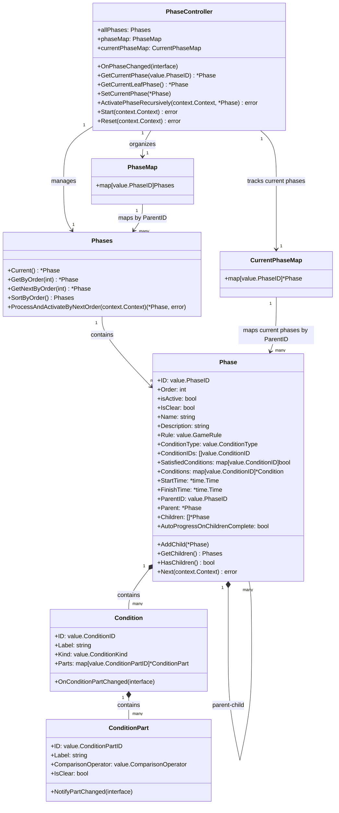
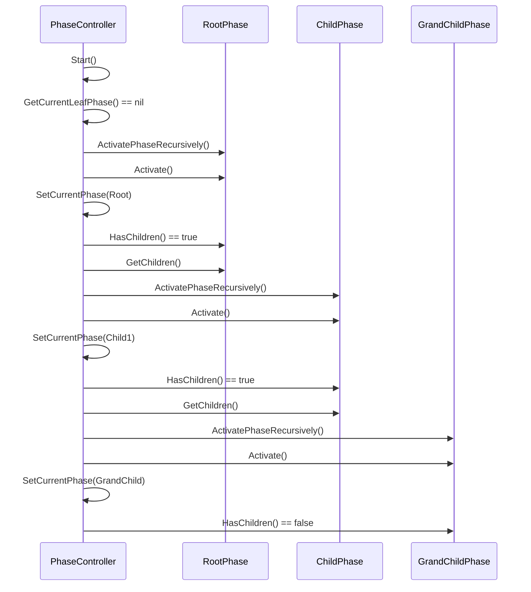
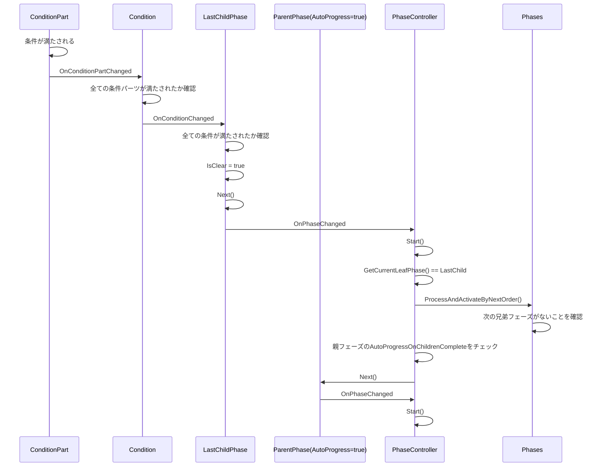
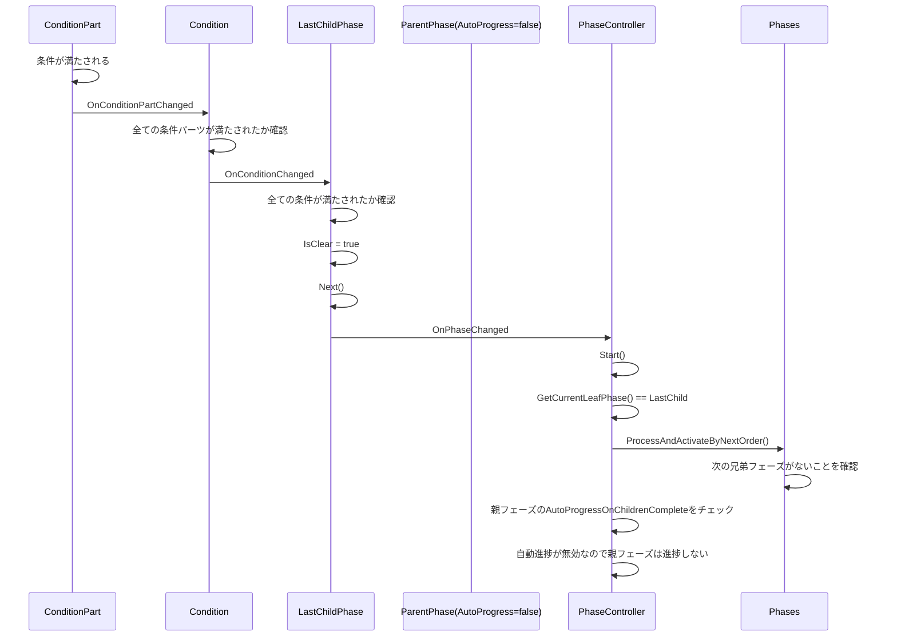

# 階層構造Phase実装計画（改訂版）

## 現状分析

現在のシステムでは、Phase、Condition、ConditionPartという3つの主要エンティティがあり、以下のような関係になっています：

- Phase: ゲームの各フェーズを表す
- Condition: フェーズの進行条件を表す
- ConditionPart: 条件の部分的な評価を表す

現在のPhase構造体には親子関係を表すフィールドがなく、フラットな構造になっています。また、フェーズの進行は`Order`フィールドに基づいて順番に行われています。

## 設計目標

1. Phaseに親子関係を持たせる（Compositeパターン）
2. 同じParentIDを持つPhaseは階層ごとにグループ化され、Orderに基づいて順番に進行する
3. 親Phaseが進捗した場合（Orderが+1された場合）、新しいOrderの親Phaseに紐づく子Phaseに切り替わる
4. 親Phaseが全ての子フェーズの進捗完了時に自動的に進捗するかどうかを設定できるようにする

## 設計案

### 1. Phase構造体の拡張

```go
type Phase struct {
    // 既存のフィールド
    ID                  value.PhaseID
    Order               int
    isActive            bool
    IsClear             bool
    Name                string
    Description         string
    Rule                value.GameRule
    ConditionType       value.ConditionType
    ConditionIDs        []value.ConditionID
    SatisfiedConditions map[value.ConditionID]bool
    Conditions          map[value.ConditionID]*Condition
    StartTime           *time.Time
    FinishTime          *time.Time
    fsm                 *fsm.FSM
    observers           []service.PhaseObserver
    mu                  sync.RWMutex
    log                 *zap.Logger
    
    // 新しいフィールド
    ParentID            value.PhaseID       // 親フェーズのID（ルートフェーズの場合は0）
    Parent              *Phase              // 親フェーズへの参照
    Children            []*Phase            // 子フェーズのスライス
    AutoProgressOnChildrenComplete bool     // 子フェーズ完了時に自動的に進捗するかどうか
}
```

### 2. Phases構造体の拡張

```go
// Phases はフェーズのコレクションを表す型です
type Phases []*Phase

// PhaseMap はParentIDごとにグループ化されたPhasesのマップです
type PhaseMap map[value.PhaseID]Phases

// CurrentPhaseMap は階層ごとの現在アクティブなフェーズを管理するマップです
type CurrentPhaseMap map[value.PhaseID]*Phase
```

### 3. NewPhase関数の拡張

```go
func NewPhase(name string, order int, conditions []*Condition, conditionType value.ConditionType, rule value.GameRule, parentID value.PhaseID, autoProgressOnChildrenComplete bool) *Phase {
    // 既存の初期化コード
    p := &Phase{
        // 既存のフィールド初期化
        ParentID:                      parentID,
        Parent:                        nil, // 後で設定
        Children:                      make([]*Phase, 0),
        AutoProgressOnChildrenComplete: autoProgressOnChildrenComplete,
    }
    
    // 既存の初期化コード
    
    return p
}
```

### 4. Phases構造体のメソッド拡張

```go
// Current は現在アクティブなフェーズを返します
func (p Phases) Current() *Phase {
    log := logger.DefaultLogger()
    log.Debug("Phases.Current")
    for _, phase := range p {
        if phase.isActive {
            log.Debug("Phases.Current", zap.String("name", phase.Name))
            return phase
        }
    }
    return nil
}

// GetByOrder は指定されたOrderを持つフェーズを返します
func (p Phases) GetByOrder(order int) *Phase {
    for _, phase := range p {
        if phase.Order == order {
            return phase
        }
    }
    return nil
}

// GetNextByOrder は現在のOrderの次のOrderを持つフェーズを返します
func (p Phases) GetNextByOrder(currentOrder int) *Phase {
    return p.GetByOrder(currentOrder + 1)
}

// SortByOrder はフェーズをOrderでソートします
func (p Phases) SortByOrder() Phases {
    sorted := make(Phases, len(p))
    copy(sorted, p)
    sort.Slice(sorted, func(i, j int) bool {
        return sorted[i].Order < sorted[j].Order
    })
    return sorted
}

// ProcessAndActivateByNextOrder は次のフェーズに移行します
// 現在のphase.goの実装を維持し、親子関係を考慮しない単純な次のフェーズへの移行を行います
func (p Phases) ProcessAndActivateByNextOrder(ctx context.Context) (*Phase, error) {
    log := logger.DefaultLogger()
    current := p.Current()
    
    // 現在アクティブなフェーズがない場合は最初のフェーズを開始
    if current == nil {
        if len(p) <= 0 {
            log.Error("Phases.ProcessAndActivateByNextOrder", zap.Error(fmt.Errorf("no phases available")))
            return nil, fmt.Errorf("no phases available")
        }
        
        // Orderでソート
        sortedPhases := p.SortByOrder()
        firstPhase := sortedPhases[0]
        
        log.Debug("Phases.ProcessAndActivateByNextOrder",
            zap.String("action", "Starting first phase"),
            zap.String("name", firstPhase.Name),
        )
        
        return firstPhase, firstPhase.Activate(ctx)
    }
    
    log.Debug("ProcessAndActivateByNextOrder: Current phase",
        zap.String("name", current.Name),
        zap.Int("order", current.Order),
        zap.String("state", current.CurrentState()))
    
    // 現在のフェーズが"next"状態の場合、次のフェーズに進む
    if current.CurrentState() == value.StateNext {
        // 現在のフェーズを終了
        if err := current.Finish(ctx); err != nil {
            log.Error("Failed to finish current phase",
                zap.String("name", current.Name),
                zap.Error(err))
            // エラーが発生しても次のフェーズに進む試みをする
        }
        
        // 次のフェーズを探す
        nextPhase := p.GetNextByOrder(current.Order)
        
        if nextPhase != nil {
            log.Debug("Phases.ProcessAndActivateByNextOrder",
                zap.String("name", nextPhase.Name),
                zap.String("action", "Activating next phase"))
            
            return nextPhase, nextPhase.Activate(ctx)
        }
        
        // 次のフェーズがない場合
        log.Debug("No next phase found")
        return nil, nil
    }
    
    return current, nil
}
```

### 5. 親子関係の設定メソッド

```go
// AddChild 子フェーズを追加します
func (p *Phase) AddChild(child *Phase) {
    p.mu.Lock()
    defer p.mu.Unlock()
    
    child.Parent = p
    p.Children = append(p.Children, child)
}

// GetChildren 子フェーズのスライスを返します（Orderでソート済み）
func (p *Phase) GetChildren() Phases {
    p.mu.RLock()
    defer p.mu.RUnlock()
    
    children := make(Phases, len(p.Children))
    copy(children, p.Children)
    return children.SortByOrder()
}

// HasChildren 子フェーズを持つかどうかを返します
func (p *Phase) HasChildren() bool {
    p.mu.RLock()
    defer p.mu.RUnlock()
    
    return len(p.Children) > 0
}
```

### 6. 親子関係の初期化処理

```go
// GroupPhasesByParentID はフェーズをParentIDごとにグループ化します
func GroupPhasesByParentID(phases Phases) PhaseMap {
    phaseMap := make(PhaseMap)
    for _, phase := range phases {
        if _, ok := phaseMap[phase.ParentID]; !ok {
            phaseMap[phase.ParentID] = make(Phases, 0)
        }
        phaseMap[phase.ParentID] = append(phaseMap[phase.ParentID], phase)
    }
    
    // 各グループをOrderでソート
    for parentID, phases := range phaseMap {
        phaseMap[parentID] = phases.SortByOrder()
    }
    
    return phaseMap
}

// InitializePhaseHierarchy はフェーズの親子関係を初期化します
func InitializePhaseHierarchy(phases Phases) {
    // IDごとにフェーズをマップ化
    phaseByID := make(map[value.PhaseID]*Phase)
    for _, phase := range phases {
        phaseByID[phase.ID] = phase
    }
    
    // 親子関係を設定
    for _, phase := range phases {
        if phase.ParentID != 0 {
            if parent, ok := phaseByID[phase.ParentID]; ok {
                parent.AddChild(phase)
                phase.Parent = parent
            }
        }
    }
}
```

### 7. PhaseControllerの拡張

```go
// PhaseController はフェーズの制御を担当するコントローラーです
type PhaseController struct {
    allPhases      Phases
    phaseMap       PhaseMap
    currentPhaseMap CurrentPhaseMap
    observers      []service.ControllerObserver
    mu             sync.RWMutex
    log            *zap.Logger
}

// NewPhaseController は新しいPhaseControllerを作成します
func NewPhaseController(phases Phases) *PhaseController {
    log := logger.DefaultLogger()
    if len(phases) <= 0 {
        log.Error("PhaseController", zap.String("error", "No phases found"))
    }
    
    // 親子関係を初期化
    InitializePhaseHierarchy(phases)
    
    // ParentIDごとにグループ化
    phaseMap := GroupPhasesByParentID(phases)
    
    pc := &PhaseController{
        allPhases:      phases,
        phaseMap:       phaseMap,
        currentPhaseMap: make(CurrentPhaseMap),
        observers:      make([]service.ControllerObserver, 0),
        log:            log,
    }
    
    log.Debug("PhaseController initialized", 
        zap.Int("phases count", len(phases)), 
        zap.String("instance", fmt.Sprintf("%p", pc)))
    
    // オブザーバーを設定
    for _, phase := range phases {
        phase.AddObserver(pc)
        log.Debug("Added observer to phase", 
            zap.String("phase", phase.Name), 
            zap.String("observer", fmt.Sprintf("%p", pc)))
        
        for _, cond := range phase.GetConditions() {
            cond.AddConditionObserver(pc)
            for _, p := range cond.GetParts() {
                p.AddConditionPartObserver(pc)
            }
        }
    }
    
    return pc
}

// OnPhaseChanged は状態変更通知を受け取るメソッドです
func (pc *PhaseController) OnPhaseChanged(phaseEntity interface{}) {
    // 型チェック
    phase, ok := phaseEntity.(*entity.Phase)
    if !ok {
        pc.log.Error("Invalid phase type in OnPhaseChanged")
        return
    }
    
    pc.log.Debug("PhaseController.OnPhaseChanged", 
        zap.String("state", phase.CurrentState()),
        zap.String("expected", value.StateNext),
        zap.Bool("equals", phase.CurrentState() == value.StateNext))
    pc.NotifyEntityChanged(phase)
    
    if phase.CurrentState() == value.StateNext {
        time.Sleep(1 * time.Second)
        pc.log.Debug("start next phase!!!!!!!!!!")
        _ = pc.Start(context.Background())
    }
}

// GetCurrentPhase は指定された親IDに対する現在のフェーズを返します
func (pc *PhaseController) GetCurrentPhase(parentID value.PhaseID) *Phase {
    pc.mu.RLock()
    defer pc.mu.RUnlock()
    return pc.currentPhaseMap[parentID]
}

// GetCurrentLeafPhase は現在アクティブな最下層のフェーズを返します
func (pc *PhaseController) GetCurrentLeafPhase() *Phase {
    pc.mu.RLock()
    defer pc.mu.RUnlock()
    
    // 現在のルートフェーズを取得
    rootPhase := pc.currentPhaseMap[0]
    if rootPhase == nil {
        return nil
    }
    
    // 子フェーズがある場合は再帰的に最下層のフェーズを探す
    return pc.findCurrentLeafPhase(rootPhase)
}

// findCurrentLeafPhase は再帰的に最下層のフェーズを探します
func (pc *PhaseController) findCurrentLeafPhase(phase *Phase) *Phase {
    if !phase.HasChildren() {
        return phase
    }
    
    childPhase := pc.currentPhaseMap[phase.ID]
    if childPhase == nil {
        return phase
    }
    
    return pc.findCurrentLeafPhase(childPhase)
}

// SetCurrentPhase は指定された親IDに対する現在のフェーズを設定します
func (pc *PhaseController) SetCurrentPhase(phase *Phase) {
    pc.mu.Lock()
    defer pc.mu.Unlock()
    
    oldPhase := pc.currentPhaseMap[phase.ParentID]
    oldPhaseName := ""
    if oldPhase != nil {
        oldPhaseName = oldPhase.Name
    }
    
    pc.currentPhaseMap[phase.ParentID] = phase
    pc.log.Debug("PhaseController.SetCurrentPhase", 
        zap.String("old phase", oldPhaseName), 
        zap.String("new phase", phase.Name),
        zap.Int64("parent_id", int64(phase.ParentID)))
}

// ActivatePhaseRecursively はフェーズを再帰的にアクティブ化します
func (pc *PhaseController) ActivatePhaseRecursively(ctx context.Context, phase *Phase) error {
    if phase == nil {
        return fmt.Errorf("phase is nil")
    }
    
    pc.log.Debug("ActivatePhaseRecursively",
        zap.String("phase", phase.Name),
        zap.Int("order", phase.Order))
    
    // フェーズをアクティブ化
    if err := phase.Activate(ctx); err != nil {
        return err
    }
    
    // 現在のフェーズとして設定
    pc.SetCurrentPhase(phase)
    
    // 子フェーズがある場合は最初の子フェーズをアクティブ化
    if phase.HasChildren() {
        children := phase.GetChildren()
        firstChild := children[0]
        
        pc.log.Debug("ActivatePhaseRecursively: Activating first child",
            zap.String("child", firstChild.Name),
            zap.Int("child_order", firstChild.Order))
        
        return pc.ActivatePhaseRecursively(ctx, firstChild)
    }
    
    return nil
}

// Start はフェーズシーケンスを開始します
func (pc *PhaseController) Start(ctx context.Context) error {
    pc.log.Debug("PhaseController.Start", zap.String("action", "Starting phase sequence"))
    
    // 現在の最下層のフェーズを取得
    currentLeafPhase := pc.GetCurrentLeafPhase()
    
    // 現在のフェーズがない場合は最初のルートフェーズから開始
    if currentLeafPhase == nil {
        rootPhases := pc.phaseMap[0]
        if len(rootPhases) <= 0 {
            pc.log.Error("PhaseController.Start", zap.Error(fmt.Errorf("no root phases available")))
            return fmt.Errorf("no root phases available")
        }
        
        firstRootPhase := rootPhases[0]
        pc.log.Debug("PhaseController.Start: Starting first root phase",
            zap.String("name", firstRootPhase.Name))
        
        return pc.ActivatePhaseRecursively(ctx, firstRootPhase)
    }
    
    // 現在のフェーズが"next"状態の場合
    if currentLeafPhase.CurrentState() == value.StateNext {
        // 同じ親を持つフェーズのグループを取得
        parentID := currentLeafPhase.ParentID
        siblingPhases := pc.phaseMap[parentID]
        
        // 次のフェーズを探す
        nextPhase, err := siblingPhases.ProcessAndActivateByNextOrder(ctx)
        
        // 次のフェーズがない場合（最後の子フェーズ）で、親フェーズがある場合
        if nextPhase == nil && currentLeafPhase.Parent != nil {
            // 親フェーズが子フェーズ完了時に自動的に進捗する設定の場合
            if currentLeafPhase.Parent.AutoProgressOnChildrenComplete {
                pc.log.Debug("Moving parent phase to next state (auto progress enabled)",
                    zap.String("parent_name", currentLeafPhase.Parent.Name))
                
                if err := currentLeafPhase.Parent.Next(ctx); err != nil {
                    pc.log.Error("Failed to move parent to next state", zap.Error(err))
                    return err
                }
                
                // 親フェーズの次のフェーズを探す（再帰的に処理）
                return pc.Start(ctx)
            } else {
                pc.log.Debug("Parent phase not set to auto progress on children complete",
                    zap.String("parent_name", currentLeafPhase.Parent.Name))
                
                // 自動進捗しない場合は現在のフェーズを維持
                return nil
            }
        }
        
        if nextPhase != nil {
            // 次のフェーズを再帰的にアクティブ化
            return pc.ActivatePhaseRecursively(ctx, nextPhase)
        } else {
            // 全てのフェーズが完了した場合
            pc.NotifyEntityChanged(nil)
            return nil
        }
    }
    
    return nil
}

// Reset は全てのフェーズをリセットします
func (pc *PhaseController) Reset(ctx context.Context) error {
    if len(pc.allPhases) <= 0 {
        err := fmt.Errorf("no phases found")
        pc.log.Error("PhaseController.Reset", zap.Error(err))
        return err
    }
    
    pc.log.Debug("PhaseController.Reset", zap.String("action", "Resetting all phases"))
    
    // 全フェーズをリセット
    for _, phase := range pc.allPhases {
        if err := phase.Reset(ctx); err != nil {
            return err
        }
    }
    
    // 現在のフェーズマップをクリア
    pc.mu.Lock()
    pc.currentPhaseMap = make(CurrentPhaseMap)
    pc.mu.Unlock()
    
    // 最初のルートフェーズを取得
    rootPhases := pc.phaseMap[0]
    if len(rootPhases) > 0 {
        firstRootPhase := rootPhases[0]
        pc.SetCurrentPhase(firstRootPhase)
        pc.log.Debug("PhaseController.Reset", zap.String("phase name", firstRootPhase.Name))
    }
    
    return nil
}
```

## 実装計画

1. **Phase構造体の拡張**:
   - ParentID、Parent、Children、AutoProgressOnChildrenCompleteフィールドを追加
   - 親子関係を管理するメソッドを追加

2. **Phases構造体の拡張**:
   - ParentIDごとにグループ化するメソッドを追加
   - Orderでソートするメソッドを追加
   - 次のフェーズを取得するヘルパーメソッドを追加
   - ProcessAndActivateByNextOrderメソッドを実装（現在のphase.goの実装を維持）

3. **CurrentPhaseMapの実装**:
   - 階層ごとの現在アクティブなフェーズを管理するマップを実装
   - 最下層のフェーズを取得するメソッドを実装

4. **親子関係の初期化処理の実装**:
   - フェーズの親子関係を初期化する関数を実装
   - ParentIDごとにフェーズをグループ化する関数を実装

5. **再帰的なフェーズアクティブ化の実装**:
   - フェーズを再帰的にアクティブ化するメソッドを実装
   - 子フェーズがある場合は最初の子フェーズをアクティブ化

6. **PhaseControllerの拡張**:
   - CurrentPhaseMapを使用して階層ごとの現在のフェーズを管理
   - 再帰的なフェーズアクティブ化を使用してフェーズ遷移を実装
   - 親フェーズの自動進捗設定に基づいた処理を実装

7. **テストの追加**:
   - 階層構造のフェーズに対するテストケースを追加
   - 親子関係のフェーズ遷移と子フェーズ切り替えのテストを追加
   - 親フェーズの自動進捗設定のテストを追加
   - 再帰的なフェーズアクティブ化のテストを追加

## クラス図



## シーケンス図: 再帰的なフェーズアクティブ化



## シーケンス図: 子フェーズから親フェーズへの進捗伝播（自動進捗有効）



## シーケンス図: 子フェーズから親フェーズへの進捗伝播（自動進捗無効）



この設計により、Compositeパターンの特性を活かした再帰的なフェーズアクティブ化と、階層ごとの現在のフェーズ管理が可能になります。また、ProcessAndActivateByNextOrderメソッドは現在のphase.goの実装を維持し、再帰的なアクティブ化は別のメソッドとして実装することで、責務を明確に分離しています。