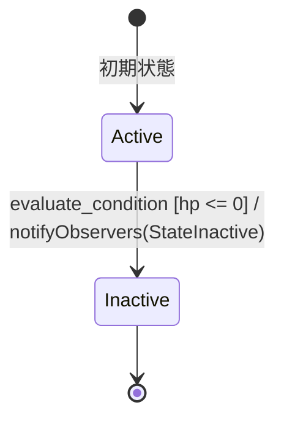

# Condition Part State Machine

条件パーツの状態を管理するステートマシン。

## 状態遷移図

## 状態の説明

### Active
- 初期状態
- 条件パーツが有効な状態
- 遷移可能なイベント: evaluate_condition（HPが0以下の場合）

### Inactive
- 条件パーツが無効化された状態
- 最終状態

## イベントとアクション

### evaluate_condition
- 発火条件: 
  * Active状態でのみ発火可能
  * HPが0以下の場合のみ発火
- アクション: 
  * 条件評価前の処理を実行
  * 状態遷移後にObserverに通知（notifyObservers）

## 特記事項

- Observerパターンを実装しており、状態変更時に登録されたObserverに通知
- AttachObserver/DetachObserverメソッドでObserverの登録/解除が可能
- HPによる条件評価ロジックが実装されている
- condition_stateとは異なり、HPに基づく具体的な評価条件が組み込まれている