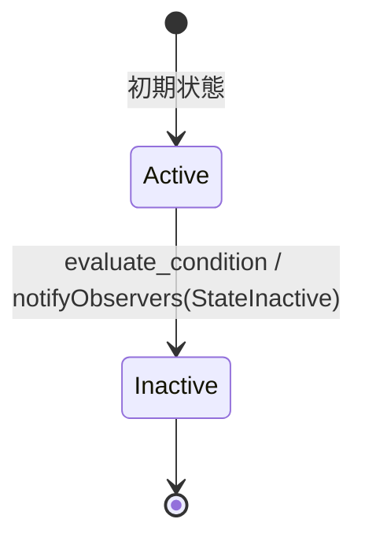

# Condition State Machine

条件の状態を管理するステートマシン。

## 状態遷移図

## 状態の説明

### Active
- 初期状態
- 条件が評価可能な状態
- 遷移可能なイベント: evaluate_condition

### Inactive
- 条件が評価済みの状態
- 最終状態

## イベントとアクション

### evaluate_condition
- 発火条件: Active状態でのみ発火可能
- アクション: 
  * 条件評価前の処理を実行
  * 状態遷移後にObserverに通知（notifyObservers）

## 特記事項

- Observerパターンを実装しており、状態変更時に登録されたObserverに通知
- AttachObserver/DetachObserverメソッドでObserverの登録/解除が可能
- 条件評価の具体的なロジックは実装側で定義