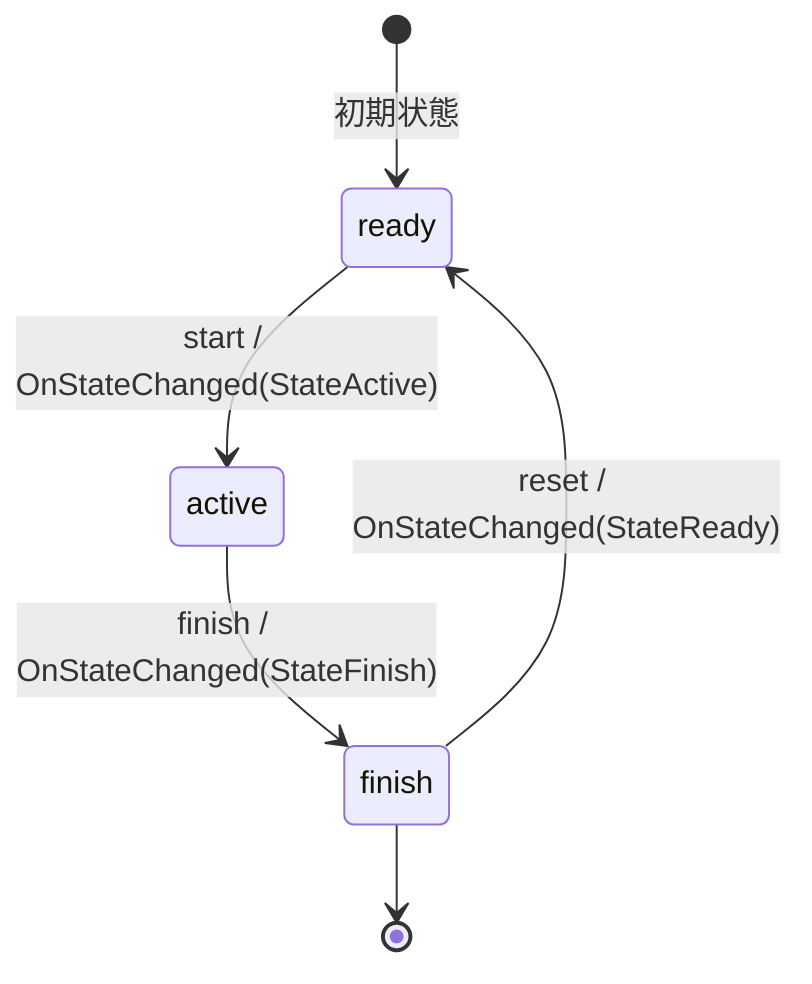

# Game State Machine

ゲームの状態を管理するステートマシン。

## 状態遷移図

## 状態の説明

### ready
- 初期状態
- ゲームが開始可能な準備状態
- 遷移可能なイベント: start

### active
- ゲームがアクティブに進行している状態
- 遷移可能なイベント: finish

### finish
- ゲーム終了状態
- 遷移可能なイベント: reset

## イベントとアクション

### start
- 発火条件: ready状態でのみ発火可能
- アクション: OnStateChanged(StateActive)を実行

### finish
- 発火条件: active状態でのみ発火可能
- アクション: OnStateChanged(StateFinish)を実行

### reset
- 発火条件: finish状態でのみ発火可能
- アクション: OnStateChanged(StateReady)を実行