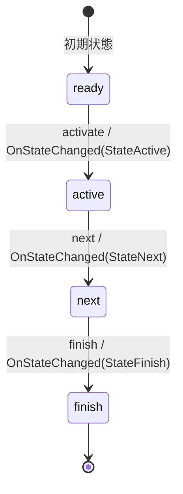

# Phase State Machine

フェーズの状態を管理するステートマシン。

## 状態遷移図

## 状態の説明

### ready
- 初期状態
- フェーズが開始可能な準備状態
- 遷移可能なイベント: activate

### active
- フェーズがアクティブに進行している状態
- 遷移可能なイベント: next

### next
- 次のフェーズへの移行準備状態
- 遷移可能なイベント: finish

### finish
- フェーズ終了状態
- 最終状態

## イベントとアクション

### activate
- 発火条件: ready状態でのみ発火可能
- アクション: OnStateChanged(StateActive)を実行

### next
- 発火条件: active状態でのみ発火可能
- アクション: OnStateChanged(StateNext)を実行

### finish
- 発火条件: next状態でのみ発火可能
- アクション: OnStateChanged(StateFinish)を実行