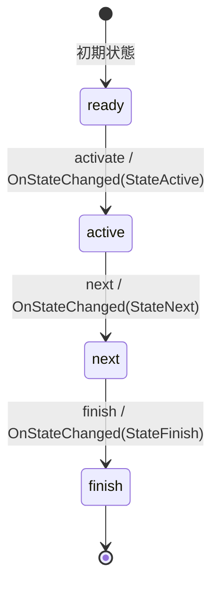

# Sub Phase State Machine

サブフェーズの状態を管理するステートマシン。

## 状態遷移図

## 状態の説明

### ready
- 初期状態
- サブフェーズが開始可能な準備状態
- 遷移可能なイベント: activate

### active
- サブフェーズがアクティブに進行している状態
- 遷移可能なイベント: next
- 条件評価機能（ConditionEvaluator）による状態監視

### next
- 次のサブフェーズへの移行準備状態
- 遷移可能なイベント: finish

### finish
- サブフェーズ終了状態
- 最終状態

## イベントとアクション

### activate
- 発火条件: ready状態でのみ発火可能
- アクション: OnStateChanged(StateActive)を実行

### next
- 発火条件: active状態でのみ発火可能
- アクション: OnStateChanged(StateNext)を実行

### finish
- 発火条件: next状態でのみ発火可能
- アクション: OnStateChanged(StateFinish)を実行

## 特記事項

- SubPhaseStateContextは、game.SubPhaseエンティティと関連付けられています
- ConditionEvaluatorを使用して、サブフェーズの条件を評価します